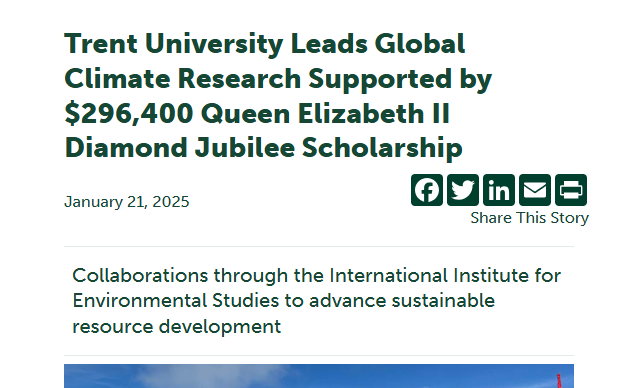

# Workshop 4

By: Melike Veyisoglu

## Emphasis

United Global Plan of Action for One Health and One Climate, a project led by *Trent University* with the International Institute for Environmental Studies has been awarded a *$296,400* Queen Elizabeth II Diamond Jubilee Scholarship (QES) from The Rideau Hall Foundation and Universities Canada, to support student- and faculty-led international research projects that focus on the adaptation, response, and resilience to a changing climate.

## Strong

“This award reflects Trent University’s leadership in fostering international **mobility and tackling global challenges** like climate change through collaboration,” said Dr. Holger Hintelmann, interim vice president of Research & Innovation at Trent University. **“As a founding member of the International Institute for Environmental Studies (IIES), Trent is committed to preparing the next generation of scholars by offering students and faculty unique opportunities to conduct research abroad and welcoming international researchers to Trent.__ These experiences allow them to engage with diverse perspectives, learn from experts worldwide, and develop a broader understanding of complex global issues beyond our borders.”

## Lists

### Unordered Lists

- List item 1
- List item 2
  - List 35
- List item 4

### Ordered Lists

1. First item
2. Second item
    1. Sub item 1
    2. Sub item 2
3. Third item

## Images



## Hyperlinks

[Trent Website](https://www.trentu.ca/news/story/41739)

## Including Code

### Inline Code

In HTML `img` tag used to display pictures

### Code Fences

```html
img
        src="./img/CSlogo-medium.png"
        height="200"
        alt="Trent Computer Science"
      />
      <h1>COIS 2430 Workshop One</h1>
      <form action="">
        <input type="search" name="search" id="search" />
        <button>Press Me</button>
      </form>
```

```css
body {
  font-family: system-ui, -apple-system, BlinkMacSystemFont, "Segoe UI", Roboto,
    Oxygen, Ubuntu, Cantarell, "Open Sans", "Helvetica Neue", sans-serif;
  height: 100vh;
  display: flex;
  flex-direction: column;
}
```
